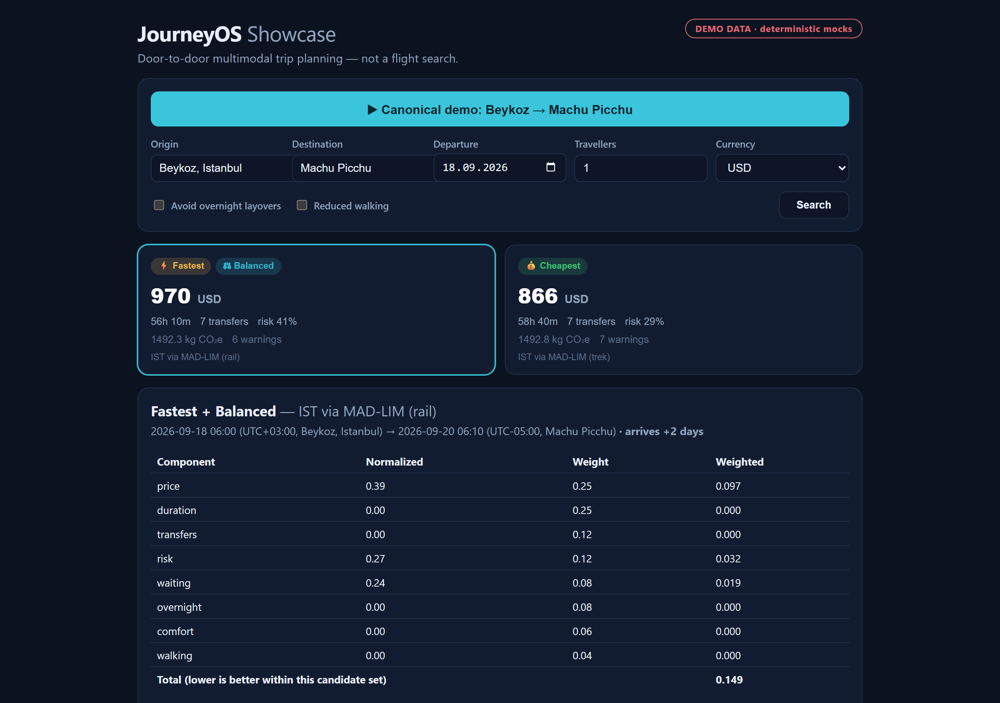
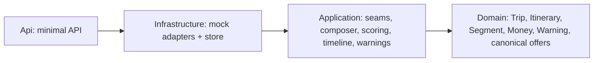
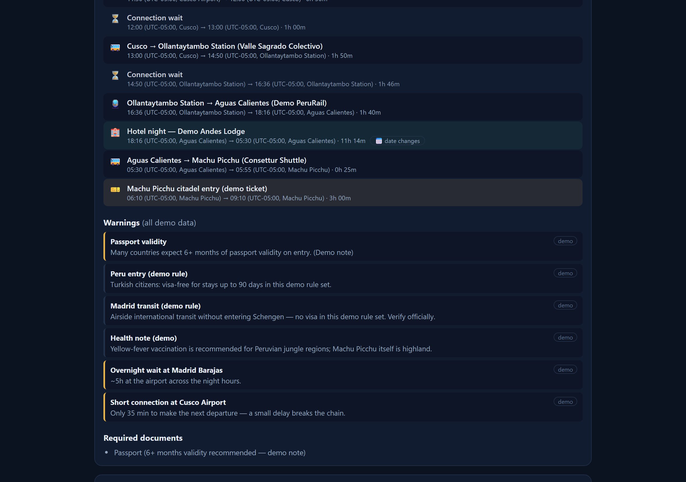
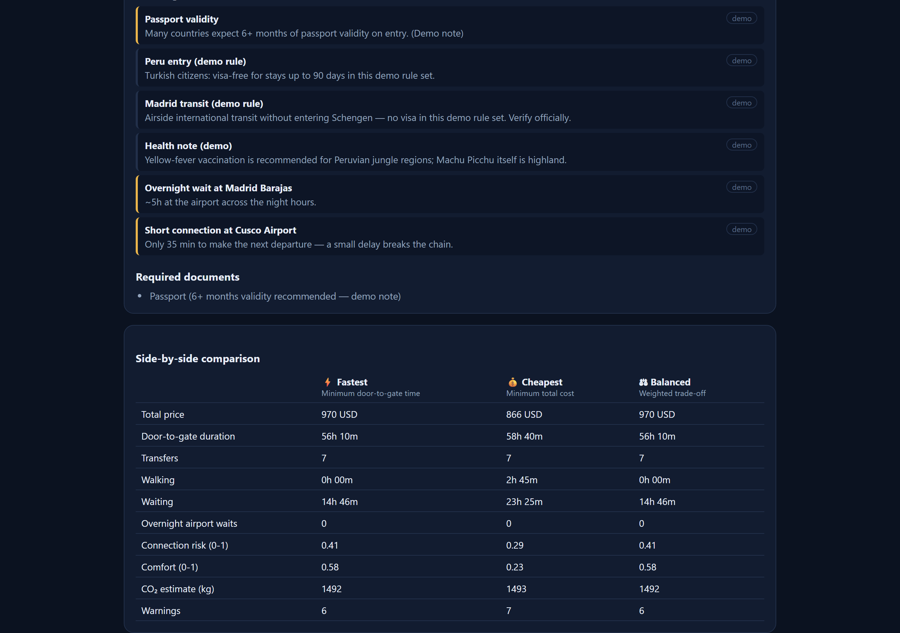

# JourneyOS Showcase

**Door-to-door multimodal trip planning — a trip is not a flight, it is a chain of
walks, rides, flights, trains, waits and nights, composed and scored end to end.**


&nbsp;·&nbsp; .NET 10 · React + Vite · 32 tests (unit + integration + e2e)


> **Everything in this demo is deterministic mock data** — prices, schedules and entry
> rules are invented and reproducible, never live. It exists to show the engineering,
> not to book travel.



*One click composes Beykoz → Machu Picchu into scored alternatives. The breakdown shows
exactly why Balanced chose this itinerary — no opaque ranking.*

---

## Why this isn't a flight-search app

A flight search answers "which plane, airport to airport". A real journey from **your
front door to the final destination** is a sequence of very different segments, and the
hard part is composing and comparing whole sequences. This engine models all of them:

`walking · taxi · private transfer · urban transit · intercity bus · train · ferry ·
domestic flight · international flight · airport access · hotel stay · wait · activity ·
border/document checkpoint`

The canonical demo composes **Beykoz, Istanbul → Machu Picchu, Peru** — a trip that only
makes sense as a chain: taxi to the airport, two flights across the Atlantic with a
connection, a domestic hop to Cusco, a train (or a budget bus + trek), a night at the
gate town, and the citadel entry the next morning.

## Showcase vs private repo

This repository is a clean, self-contained extraction of the composition core from a
larger private product. It reimplements that core with mock providers; it does **not**
copy the private system.

| | Showcase (this repo) | Private repo |
|---|---|---|
| Composition core (providers, composer, scoring, timeline, warnings) | ✅ | ✅ |
| Mock providers, deterministic, offline | ✅ | ✅ (+ live + paid seams) |
| Live free-data adapters (geocoding, roads, weather, advisories, airports, aircraft, FX) | 🔒 | ✅ |
| Config-gated paid seams (flights / hotels / fares / flight-status) | 🔒 | ✅ |
| Persistence (EF Core, migrations), auth, admin, i18n-as-data, payments/loyalty | 🔒 | ✅ |
| Test suite | 32 | 355 |

## Architecture



Ten provider seams, one canonical model, a candidate-space composer, a normalized
scorer, a dual-clock timeline builder and a rule-based warning engine. Full detail in
[`docs/architecture.md`](docs/architecture.md).

## Main engineering challenges

- **Candidate-space composition.** Enumerate real alternatives (origin gateway × flight
  path × ground approach × access mode × overnight flavour), not one "best" guess, so
  the scorer has genuine trade-offs. [`docs/itinerary-composition.md`](docs/itinerary-composition.md)
- **Canonical normalization.** Each adapter owns a private wire format and maps it to
  canonical offers; provider DTOs never leak inward, which is what makes mock↔live a
  DI-only swap. [`docs/canonical-model.md`](docs/canonical-model.md)
- **Honest scoring.** Min-max normalize metrics across the candidate set, weight per
  profile, return a component breakdown and a comparative explanation.
  [`docs/scoring.md`](docs/scoring.md)
- **Cross-hemisphere time math.** Store UTC, render both endpoint local clocks, surface
  date rollovers and arrival-day offsets (Istanbul +03:00 → Lima −05:00).
  [`docs/timeline.md`](docs/timeline.md)
- **Deterministic mocking.** No `Random`, no wall clock — fares jitter through a stable
  hash so the whole suite is reproducible. [`docs/testing.md`](docs/testing.md)
- **Preferences that degrade out loud.** "Max 1 transfer" to Machu Picchu is impossible.
  Returning nothing is useless; quietly returning 7-transfer routes is a lie. The engine
  relaxes the constraint, names it in the response, and the UI says so.
  [`docs/itinerary-composition.md`](docs/itinerary-composition.md)

## Feature matrix

| Capability | Showcase | Private | Roadmap |
|---|---|---|---|
| 14 segment modes, door-to-door chains | ✅ | ✅ | |
| Fastest / Cheapest / Balanced with breakdown | ✅ | ✅ | |
| Timeline w/ buffers, tz + date rollover | ✅ | ✅ | |
| 15 warning rules (demo data) | ✅ | ✅ (live feeds) | |
| Provider adapter seams | ✅ (mock) | ✅ (live + paid) | |
| Return-leg composition | | partial | 🗺 |
| Real timezones (IANA/DST) | | ✅ | 🗺 |
| Persistence / accounts / admin | | ✅ | (out of scope) |

## Quickstart

```bash
# Backend — API on http://localhost:5100
dotnet run --project backend/src/JourneyOS.Showcase.Api

# Frontend — Vite dev server (proxies /api to 5100)
cd frontend && npm install && npm run dev

# Tests
dotnet test JourneyOS.Showcase.slnx
```

One request:

```bash
curl -s -X POST http://localhost:5100/api/trips/search \
  -H "Content-Type: application/json" \
  -d '{"origin":"Beykoz, Istanbul","destination":"Machu Picchu",
       "departureDate":"2026-09-18","travellers":2,"currency":"USD"}'
```

```jsonc
{
  "id": "<guid>",
  "profiles": { "Fastest": "<guid>", "Cheapest": "<guid>", "Balanced": "<guid>" },
  "itineraries": [
    { "label": "IST via MAD-LIM (rail)", "totalPrice": 1889.65, "currency": "USD",
      "totalDurationMinutes": 3370, "transferCount": 7, "riskScore": 0.41, "warningCount": 6 },
    { "label": "IST via MAD-LIM (trek)", "totalPrice": 1732.26, "currency": "USD",
      "totalDurationMinutes": 3520, "transferCount": 7, "riskScore": 0.29, "warningCount": 7 }
  ]
}
```

Here the cheaper "trek" alternative saves money but adds ~2.5h and a long walk, so
**Cheapest** picks it while **Fastest** and **Balanced** prefer the rail route — a real,
scored decision. When one itinerary dominates a profile, two profile chips sit on one
card (honest, not a bug).

## The 3-minute demo route

Open the UI, click **"Canonical demo: Beykoz → Machu Picchu"**, then read the three
profile cards, open the timeline (watch the Istanbul → Lima clocks and the *arrives +2
days* note), read the score breakdown + explanation, and scroll to the comparison table.
Toggle *Avoid overnight layovers* or *Reduced walking* to change the candidate set.
Full script: [`docs/demo.md`](docs/demo.md).

## How scoring works (in one glance)

Eight metrics (price, duration, transfers, risk, waiting, overnight, comfort, walking)
are min-max normalized across the candidates, then weighted per profile (each profile's
weights sum to 1). Lowest weighted total wins and carries its breakdown — the real
output for the two-traveller request shown above (the screenshots run one traveller, so
the savings there are half these):

```
Balanced   price 0.39×0.25=0.097 · duration 0.00×0.25=0.000 · risk 0.27×0.12=0.032
           waiting 0.24×0.08=0.019 · transfers/overnight/comfort/walking 0.000
           total 0.149
           "About as quick as the fastest option, but saves 73 USD and safer connections."

Cheapest   "2.5h longer than the fastest option, but saves 230 USD and safer connections."
```

Details + the weight table: [`docs/scoring.md`](docs/scoring.md).

## What is NOT real

Every price, schedule, hotel, activity and entry/visa/health rule is **deterministic
mock data**, labelled as such in the UI (a persistent badge + a "demo" chip on every
warning). Warnings are demonstration rules, not travel advice. See
[`docs/limitations.md`](docs/limitations.md).

## Screenshots

All four are produced by `node tools/screenshots.mjs` against a running stack — the
demo is deterministic, so the images can never drift from what the code renders.

**The composed timeline** — every buffer, wait and hop, with both endpoint clocks and
explicit timezone / date-change markers:


**The warning engine** — rules derived from the composed chain (short connection,
overnight airport wait, transit and health notes), every row flagged as demo data:



**Side-by-side comparison** across the three profiles:



## Tests & CI

32 tests: unit (Haversine, normalization, composer continuity/determinism/fail-soft,
timezones, scoring, warnings), WebApplicationFactory integration (all endpoints, error
codes), and an end-to-end canonical-demo test. CI (`.github/workflows/ci.yml`) runs
backend build + tests + coverage, frontend lint + build, and a Docker image build.
See [`docs/testing.md`](docs/testing.md).

## Documentation

**Start here:** [engineering-decisions](docs/engineering-decisions.md) — the trade-offs,
the rejected alternatives and what would make me revisit each one.

[architecture](docs/architecture.md) · [provider-adapters](docs/provider-adapters.md) ·
[canonical-model](docs/canonical-model.md) · [itinerary-composition](docs/itinerary-composition.md) ·
[scoring](docs/scoring.md) · [timeline](docs/timeline.md) · [warnings](docs/warnings.md) ·
[testing](docs/testing.md) · [demo](docs/demo.md) · [security](docs/security.md) ·
[limitations](docs/limitations.md) · [roadmap](docs/roadmap.md)

## License

MIT — see [LICENSE](LICENSE).
