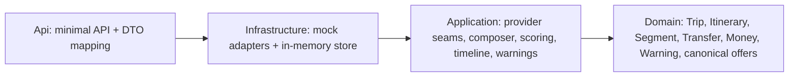
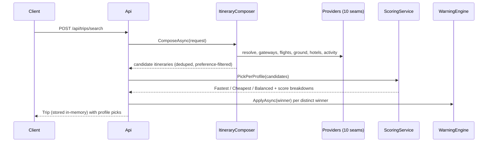

# Architecture

Four projects, strict inward dependencies — the same layering the private JourneyOS system uses:

## Request flow

Key decisions:

- **Candidate space, not one answer.** The composer enumerates real alternatives
  (gateway × flight path × ground approach × access mode × overnight flavour) so the
  scorer has genuine trade-offs to choose between.
- **Canonical model boundary.** Provider adapters normalize their private wire DTOs
  into `TransportOffer`/`StayOffer`/`ActivityOffer` before anything else sees them.
- **Fail-soft composition.** A throwing provider removes its candidates, never the search.
- **No persistence by design.** Trips live in an in-memory store; the private system
  uses EF Core — out of scope here (see limitations.md).
